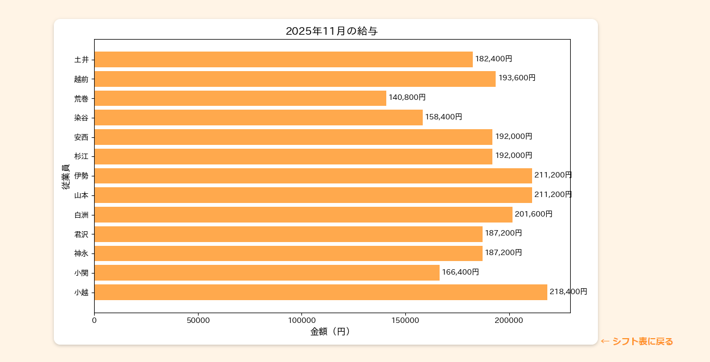
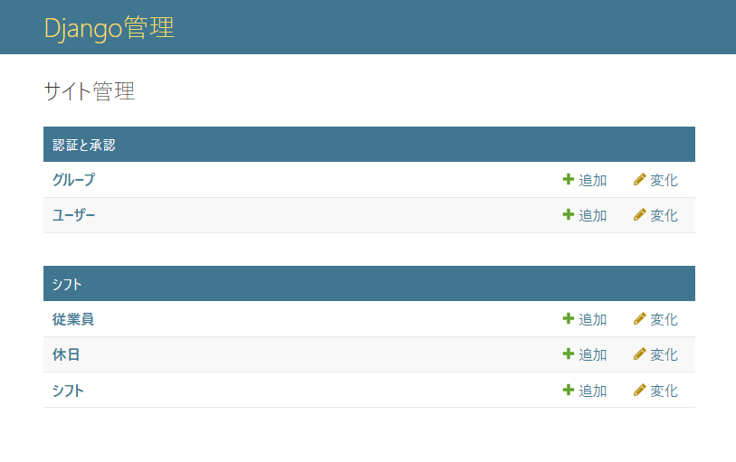
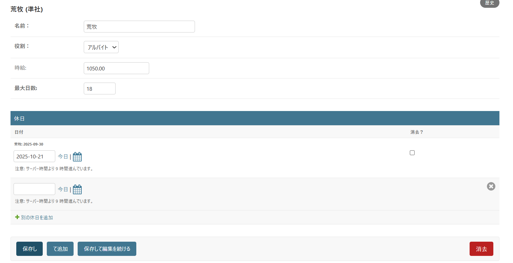

# シフト管理システム

従業員のシフト自動作成と給与計算を行うWebアプリケーション

## 🌐 デモサイト
https://my-shift-app-project.onrender.com/shift_matrix/

※ 無料ホスティングのため、初回アクセス時は起動に1-2分かかります。「Bad Gateway」が表示された場合は、少々お待ちいただき再読み込みをお願いします。

## 📸 スクリーンショット

### シフト表画面

### 給与グラフ

### 時給設定

### 管理画面

### 役職や希望休設定画面

## ⚙️ 技術スタック
- **バックエンド**: Python, Django 5.2
- **データベース**: PostgreSQL
- **フロントエンド**: HTML, CSS, JavaScript
- **データ可視化**: Matplotlib, japanize-matplotlib
- **デプロイ**: Render

## ✨ 主な機能
- シフトの自動作成（勤務日数・連続勤務制約を考慮）
- 月別シフト表の表示
- 給与グラフの可視化
- Excel/CSV形式でのエクスポート
- 管理者画面での従業員管理

## 📝 開発の背景
以前シフト制の職場で働いていた際、シフト作成の担当者が毎回大変そうに作成していたのを見て、もっと便利にできるツールがあればいいなと思い開発しました。手動でのシフト作成の手間を削減し、公平なシフト配分を実現することを目指しました。

##  ❕ 今後の改善点
現在は早番、中番、遅番の３パターンのみでシフトを組んでいますが、１時間ごとに設定できたりと、もう少し柔軟なシフトを作れるようにする。